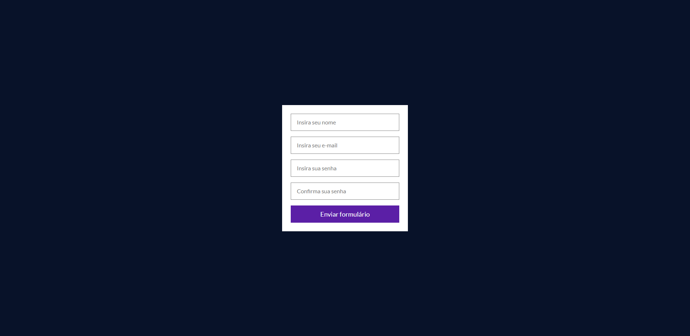

Projeto: React-hook-form

O Objetivo do projeto é colocar em prática o conteúdo ensinado no curso.

O React Hook Form é uma lib de gerenciamento de formulários que controla os dados dos componentes utilizando o conceito de REF de forma que não depende do estado do componente. Sendo assim, o componente é mais performático, pois não re-renderiza a toda mudança de valor dos inputs como em outras libs.

Formulários de alto desempenho, flexíveis e extensíveis com validação fácil de usar.


## Screenshots


## Funcionalidades

- Formulario simples
- Validação dos inputs & FeedBacks
- Layout simples
## Stack utilizada

**Front-end:** React, React Hook Form, styled-components
## Criador & Autor

- [@WillMoreiraDev](https://www.linkedin.com/in/willmoreira/)

- [@Vitor-Linaris](https://www.linkedin.com/in/vitor-linaris-a33a95235/)
## 🔗 Links
[](https://keepo.io/linarisdev/)
[](https://www.linkedin.com/in/vitor-linaris-a33a95235/)
[](https://www.instagram.com/linaris.dev/)


## Instalação

Instale React Hook Form com npm ou yarn

```bash
  npm install ou yarn install
```

Rodar local

```bash
  npm run dev ou yarn dev
```
    